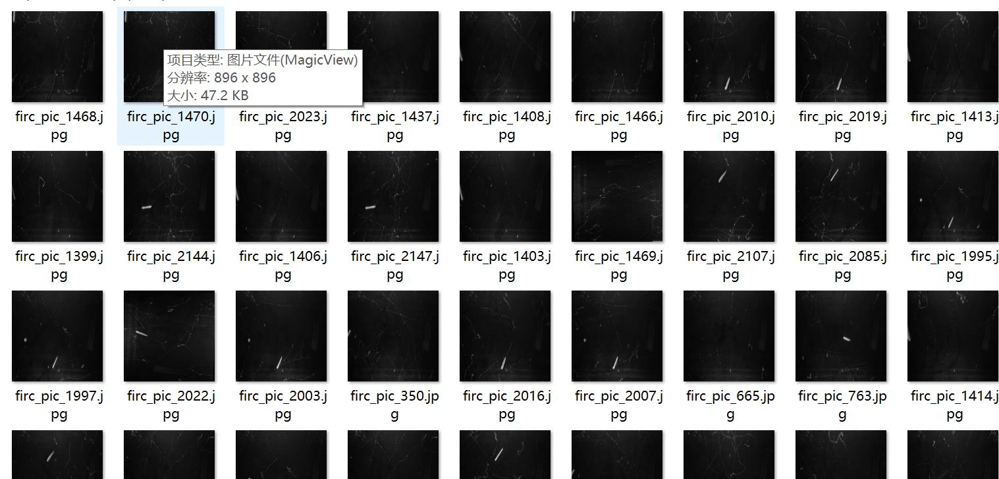
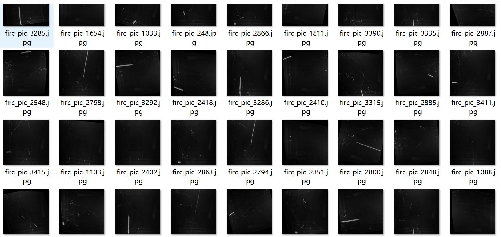
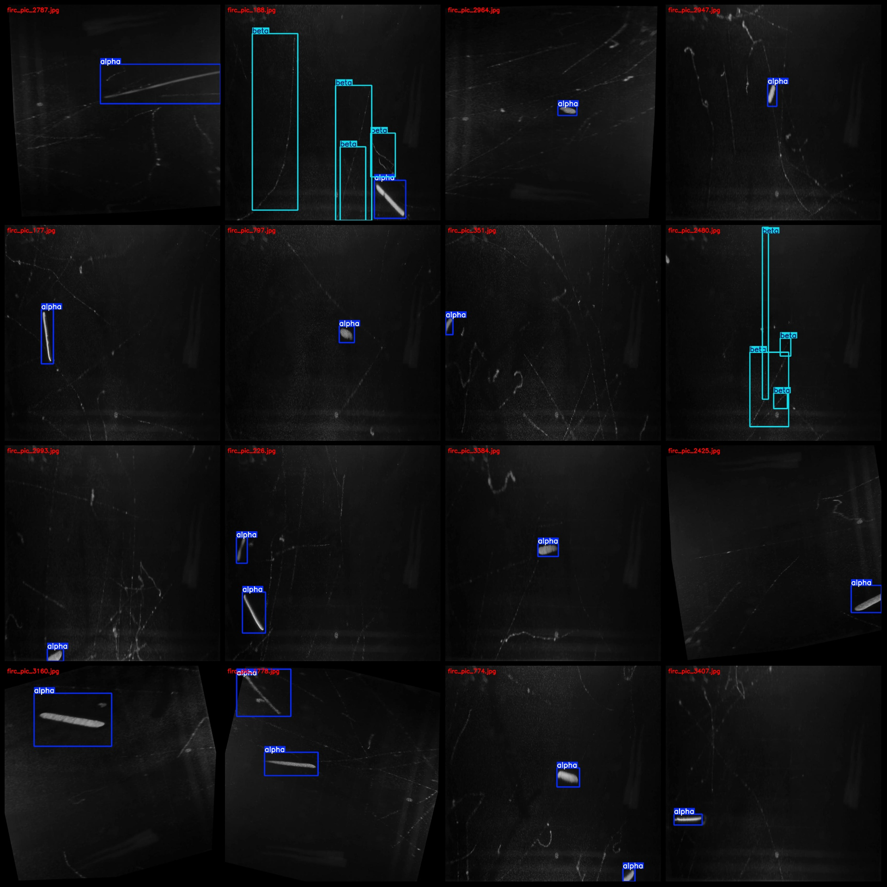
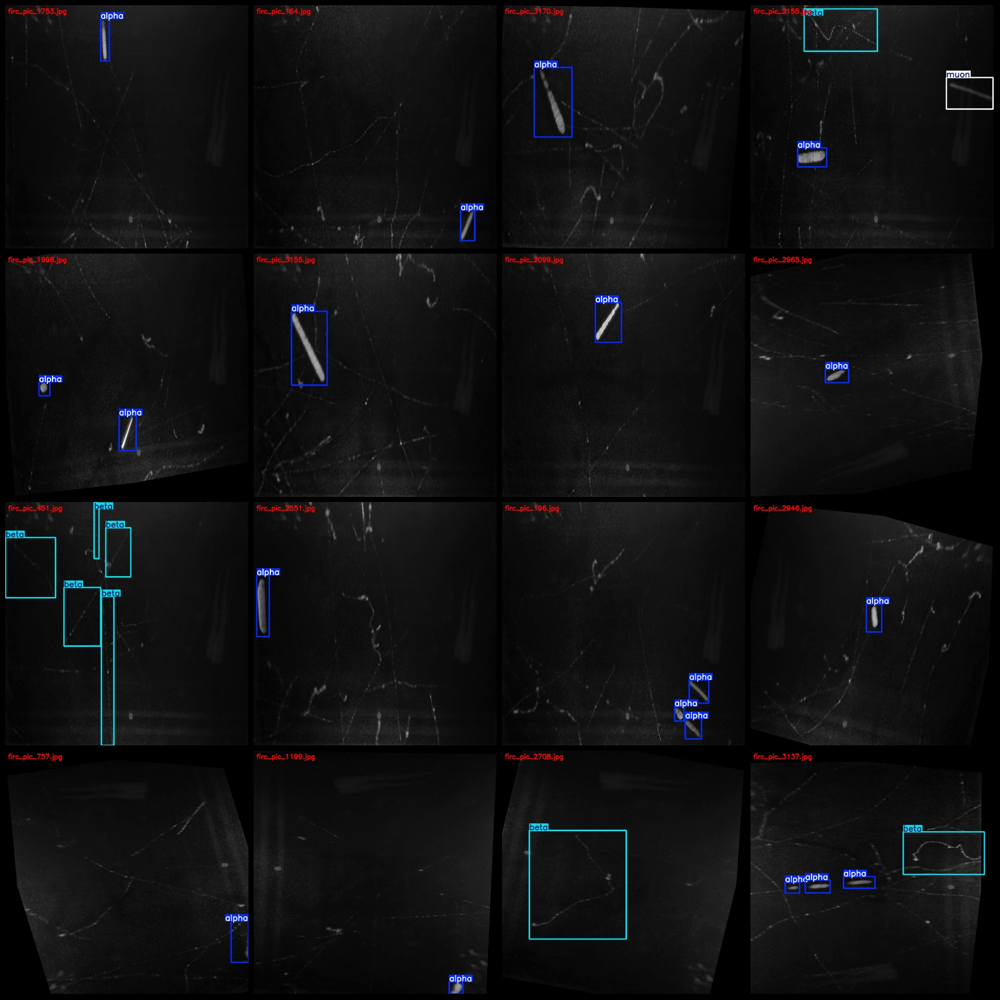

# Cloud Chamber Particle Detection Classification dataset for recognizing alpha, beta, muon detection with VOC+YOLO format (1465 images in JPG format)

Dataset format: Pascal VOC format + YOLO format (txt file without segmentation path, only containing JPG images and corresponding VOC format xml files and YOLO format txt files)
Number of images (JPG file count): 1465
Number of annotations (xml file count): 1465
Number of annotations (txt file count): 1465
Number of annotation categories: 3
Annotation category names (note that the order of categories in YOLO format is not consistent with this, but based on the labels folder 'classes.txt'): ["alpha", "beta", "muon"]
Boxes per category:
- alpha boxes = 1562
- beta boxes = 1241
- muon boxes = 56
Total boxes = 2859
Number of images per category:
- alpha images = 1300
- beta images = 449
- muon images = 53
Image resolution: 896x896
Annotation tool used: labelImg
Annotation rules: draw a box around the category
Important note: The dataset does not have separate training, validation, and test sets; you will need to divide them yourself.
Special declaration: This dataset does not guarantee the accuracy of the trained model or weight files.
Image preview:
Annotation examples:

## Images

Here is a pay link on Stripe ( https://buy.stripe.com/3cs8yP7sY87d0vu9AB ). Please contact me lonlonago@foxmail.com after funding $89, and I will send you a complete data files , thank you!

